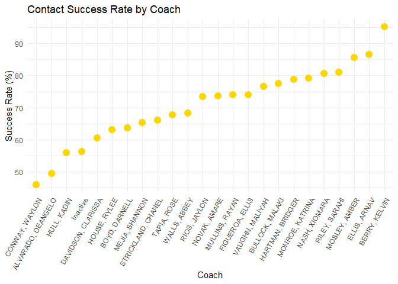
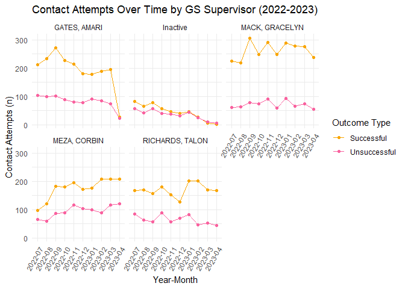

YS SPA Assessment
================
Sanika Sule
2024-05-20

``` r
youth_info = readxl::read_excel("data/YS SPA Assessment (1).xlsx",  
             sheet = "Youth Info")|>
             janitor::clean_names()
employment_info = readxl::read_excel("data/YS SPA Assessment (1).xlsx",  
             sheet = "Employment Info")|>
             janitor::clean_names()
education_status = readxl::read_excel("data/YS SPA Assessment (1).xlsx",  
             sheet = "Education Status")|>
             janitor::clean_names()
contacts = readxl::read_excel("data/YS SPA Assessment (1).xlsx",  
             sheet = "Contacts")|>
             janitor::clean_names()
```

``` r
youth_info = youth_info |>
  mutate(gs_total_time = as.numeric(difftime(gs_end_dt, gs_start_dt, units = "days") / 365))
#Calculating average time spent enrolled in SLAM
average_gs_total_time = mean(youth_info$gs_total_time, na.rm = TRUE)
print(average_gs_total_time)
```

    ## [1] 4.899754

``` r
youth_info = youth_info |>
  mutate(dob = as.Date(dob))

# Calculate the age
youth_info = youth_info |>
  mutate(age = as.numeric(difftime(Sys.Date(), dob, units = "days")) / 365)

youth_info = youth_info |>
  mutate(age_group = cut(age, 
                         breaks = c(14, 17, 21, 25, 29, Inf), 
                         labels = c("14-17", "18-21", "22-25", "26-29", "30+"),
                         right = FALSE))
```

Among students who have disenrolled from active coaching, the average
time spent in SLAM is 4.90 years.

``` r
youth_info = youth_info |>
  mutate(clt_nbr = as.character(clt_nbr))
education_status <- education_status |>
  mutate(clt_nbr = as.character(clt_nbr))

education_status = education_status |>
  left_join(youth_info |> select(clt_nbr, gs_start_dt), by = "clt_nbr")
names(education_status) = tolower(names(education_status))

# Extracting year from gs_start_date
education_status <- education_status |>
  mutate(gs_start_dt = as.Date(gs_start_dt)) |>
  mutate(start_year = format(gs_start_dt, "%Y"))
```

``` r
# Filter the data for students with "None" under highest_diploma
none_hs_diploma = education_status |>
  filter(highest_diploma == "None")

# Count the occurrences of each current_school_status
none_diploma_status = none_hs_diploma |>
  group_by(current_school_status) |>
  summarise(count = n())

# Calculate the total number of students in the filtered data
total_students = sum(none_diploma_status$count)

# Calculate the percentages for each current_school_status
none_diploma_status = none_diploma_status |>
  mutate(percentage = (count / total_students) * 100)
kable(none_diploma_status)
```

| current_school_status | count | percentage |
|:----------------------|------:|-----------:|
| Enrolled in GED       |     4 |   2.702703 |
| In School             |    99 |  66.891892 |
| Not in School         |    45 |  30.405405 |

``` r
summary_data = education_status |>
  group_by(start_year, highest_diploma) |>
  summarise(count = n(), .groups = 'drop')

custom_colors = c(
  "Vocational Certificate" = "#F47D73",
  "Unknown" = "#F49A73",
  "None" = "#F8766D",
  "Master's Degree" = "#F4B173",
  "HS Diploma" = "#F9A602",
  "GED" = "#F9629F",
  "Bachelor's Degree" = "#FAA3A3",
  "Associate's Degree" = "#FAA376"
)

# Highest Diploma by Start Year Bar Chart
ggplot(summary_data, aes(x = count, y = highest_diploma, fill = highest_diploma)) +
  geom_bar(stat = "identity") +
  facet_wrap(~ start_year) +
  scale_fill_manual(values = custom_colors) +
  labs(title = "Highest Diploma by SLAM Start Year",
       x = "Count",
       y = "Highest Diploma",
       fill = "Highest Diploma") +
  theme_minimal() +
  theme(axis.text.x = element_text(angle = 45, hjust = 1),
        panel.grid.major = element_blank(),
        panel.grid.minor = element_blank(),
        legend.position = "bottom")
```

<!-- -->

``` r
# Calculate the total number of students
total_students = nrow(education_status)

# Calculate the count and percentage of each highest_diploma based on the total number of students
diploma_summary = education_status |>
  group_by(highest_diploma) |>
  summarise(count = n()) |>
  mutate(percentage = (count / total_students) * 100)

# Print the summary data to verify
kable(diploma_summary)
```

| highest_diploma        | count | percentage |
|:-----------------------|------:|-----------:|
| Associate’s Degree     |     3 |  0.9966777 |
| Bachelor’s Degree      |    10 |  3.3222591 |
| GED                    |    13 |  4.3189369 |
| HS Diploma             |   120 | 39.8671096 |
| Master’s Degree        |     1 |  0.3322259 |
| None                   |   148 | 49.1694352 |
| Unknown                |     4 |  1.3289037 |
| Vocational Certificate |     2 |  0.6644518 |

``` r
# Formatting 'start_dt' and 'end_dt' as dates and converting 8900 to current date
employment_info = employment_info |>
  mutate(end_dt = as.Date(ifelse(end_dt == "8900-12-31", end_dt, Sys.Date()), format = "%Y-%m-%d"))

employment_info = employment_info |>
  mutate(start_dt = as.Date(start_dt, format = "%Y-%m-%d"))

employment_info = employment_info |>
  mutate(employment_time_days = as.numeric(difftime(end_dt, start_dt, units = "days")))

# Average length of employment in years
employment_info |>
  summarise(average_length_years = mean(employment_time_days, na.rm = TRUE) / 365)
```

    ## # A tibble: 1 × 1
    ##   average_length_years
    ##                  <dbl>
    ## 1                 1.66

Among students who report employment during this period, the average
length of employment is 1.66 years.

``` r
emp_total = nrow(employment_info)

# employment_level percentage and count calculations
employment_level_summary <- employment_info |>
  group_by(employment_level) |>
  summarise(count = n()) |>
  mutate(percentage = (count / emp_total) * 100)

# employment_level summary data
kable(employment_level_summary)
```

| employment_level      | count | percentage |
|:----------------------|------:|-----------:|
| Full Time Job         |    39 | 13.1313131 |
| Internship            |     6 |  2.0202020 |
| Internship - External |     3 |  1.0101010 |
| Internship - Internal |     7 |  2.3569024 |
| Other Seasonal Job    |     1 |  0.3367003 |
| Part Time Job         |    49 | 16.4983165 |
| NA                    |   192 | 64.6464646 |

``` r
# outcome_desc percentage and count calculations
outcome_desc_summary <- employment_info |>
  group_by(outcome_desc) |>
  summarise(count = n()) |>
  mutate(percentage = (count / emp_total) * 100)

# outcome_desc summary data
kable(outcome_desc_summary)
```

| outcome_desc         | count | percentage |
|:---------------------|------:|-----------:|
| Currently Employed   |    56 | 18.8552189 |
| Laid Off             |     1 |  0.3367003 |
| Position Ended       |    10 |  3.3670034 |
| Terminated from Job  |    14 |  4.7138047 |
| Voluntarily Left Job |    34 | 11.4478114 |
| NA                   |   182 | 61.2794613 |

``` r
employment_info <- employment_info %>%
  mutate(start_dt = as.Date(start_dt, format = "%Y-%m-%d"),
         start_year = year(start_dt))

# Employment initiation yearly counts
yearly_counts <- employment_info |>
  group_by(start_year) |>
  summarise(count = n())

# Employment initiation line graph
ggplot(yearly_counts, aes(x = start_year, y = count)) +
  geom_line() +
  geom_point() +
  geom_text(aes(label = count), vjust = -0.5) + 
  labs(title = "Initiation of Employment Over Time (2019-2023)",
       x = "Year",
       y = "New Student Employment (n)") +
  theme_minimal()
```

<!-- -->

``` r
youth_info = youth_info |>
  mutate(clt_nbr = as.character(clt_nbr))
contacts = contacts |>
  mutate(clt_nbr = as.character(clt_nbr))

# Select coach and supervisor columns
youth_info_selected = youth_info |>
  select(clt_nbr, coach_name, gs_supervisor)

# Merge the contacts sheet with the selected columns from youth_info on clt_nbr
contacts = contacts |>
  left_join(youth_info_selected, by = "clt_nbr")
```

``` r
# Define "Engaged / Responded" as a successful attempt
success_label = "Engaged / Responded"
unique(contacts$contact_outcome)
```

    ## [1] "Engaged / Responded"    "Attempt / No Response"  "Attended Session"      
    ## [4] NA                       "Did Not Attend Session"

``` r
# Calculate the percentage of successful attempts by coach_name
coach_contacts = contacts |>
  group_by(coach_name) |>
  summarise(total_attempts = n(),
            successful_attempts = sum(contact_outcome == success_label, na.rm = TRUE),
            success_percentage = (successful_attempts / total_attempts) * 100) |>
  arrange(desc(success_percentage))|>
  rename(`Coach` = coach_name, `Total Attempts` = total_attempts, `Successful Attempts` = successful_attempts, `Success Rate` = success_percentage)

# Print the success table
kable(coach_contacts)
```

| Coach              | Total Attempts | Successful Attempts | Success Rate |
|:-------------------|---------------:|--------------------:|-------------:|
| BERRY, KELVIN      |             62 |                  59 |     95.16129 |
| ELLIS, ARNAV       |             37 |                  32 |     86.48649 |
| MOSLEY, AMBER      |             42 |                  36 |     85.71429 |
| RILEY, SARAHI      |            820 |                 665 |     81.09756 |
| NASH, XIOMARA      |            917 |                 740 |     80.69793 |
| MONROE, KATRINA    |            634 |                 502 |     79.17981 |
| HARTMAN, BRIDGER   |            931 |                 734 |     78.83996 |
| BULLOCK, MALAKI    |            585 |                 453 |     77.43590 |
| VAUGHN, MALIYAH    |            651 |                 499 |     76.65131 |
| FIGUEROA, ELLIS    |            740 |                 548 |     74.05405 |
| MULLINS, RAYAN     |            598 |                 442 |     73.91304 |
| NOVAK, AMARE       |            594 |                 437 |     73.56902 |
| RIOS, JAYLON       |            811 |                 595 |     73.36621 |
| WALLS, ABBEY       |            629 |                 429 |     68.20350 |
| TAPIA, ROSE        |            201 |                 136 |     67.66169 |
| STRICKLAND, CHANEL |            442 |                 292 |     66.06335 |
| MEJIA, SHANNON     |            426 |                 278 |     65.25822 |
| BOYD, DARNELL      |             55 |                  35 |     63.63636 |
| HOUSE, RYLEE       |            284 |                 179 |     63.02817 |
| DAVIDSON, CLARISSA |            329 |                 199 |     60.48632 |
| Inactive           |            802 |                 451 |     56.23441 |
| HULL, KADIN        |            600 |                 335 |     55.83333 |
| ALVARADO, DEANGELO |            156 |                  77 |     49.35897 |
| CONWAY, WAYLON     |            646 |                 297 |     45.97523 |

``` r
coach_contacts |>
  summarise(average_success_rate = mean(`Success Rate`, na.rm = TRUE))
```

    ## # A tibble: 1 × 1
    ##   average_success_rate
    ##                  <dbl>
    ## 1                 70.7

The average contact success rate among all coaches is 70.70%.

``` r
ggplot(coach_contacts, aes(x = reorder(Coach, `Success Rate`), y = `Success Rate`)) +
  geom_point(size = 4, color = "gold") +
  labs(title = "Contact Success Rate by Coach",
       x = "Coach",
       y = "Success Rate (%)") +
  theme_minimal() +
  theme(axis.text.x = element_text(angle = 60, hjust = 1))
```

<!-- -->

``` r
supervisor_contacts = contacts |>
  group_by(gs_supervisor) |>
  summarise(total_attempts = n(),
            successful_attempts = sum(contact_outcome == success_label, na.rm = TRUE),
            success_percentage = (successful_attempts / total_attempts) * 100) |>
  arrange(desc(success_percentage))|>
  rename(`GS Supervisor` = gs_supervisor, `Total Attempts` = total_attempts, `Successful Attempts` = successful_attempts, `Success Rate` = success_percentage)

# Print the success table
kable(supervisor_contacts)
```

| GS Supervisor   | Total Attempts | Successful Attempts | Success Rate |
|:----------------|---------------:|--------------------:|-------------:|
| MACK, GRACELYN  |           3339 |                2618 |     78.40671 |
| RICHARDS, TALON |           2371 |                1697 |     71.57318 |
| GATES, AMARI    |           2770 |                1930 |     69.67509 |
| MEZA, CORBIN    |           2710 |                1754 |     64.72325 |
| Inactive        |            802 |                 451 |     56.23441 |

``` r
contacts = contacts |>
  mutate(contact_event_date = as.Date(contact_event_date, format = "%Y-%m-%d"),
         year_month = format(contact_event_date, "%Y-%m"))

# Define successful and unsuccessful labels
success_label = "Engaged / Responded"
unsuccessful_label = "Attempt / No Response"

# Calculate the number of success and unsuccessful attempts per month by gs_supervisor
monthly_counts = contacts |>
  mutate(outcome_type = case_when(
    contact_outcome == success_label ~ "Successful",
    contact_outcome == unsuccessful_label ~ "Unsuccessful",
    TRUE ~ "Other"
  )) |>
  filter(outcome_type %in% c("Successful", "Unsuccessful")) |>
  group_by(gs_supervisor, year_month, outcome_type) |>
  summarise(count = n(), .groups = 'drop')

# Define custom colors for outcome types
gs_colors = c(
  "Successful" = "#F9A602",  
  "Unsuccessful" = "#F9629F" 
)

# Create the line graph using ggplot2
ggplot(monthly_counts, aes(x = year_month, y = count, color = outcome_type, group = outcome_type)) +
  geom_line() +
  geom_point() +
  facet_wrap(~ gs_supervisor) +
  scale_color_manual(values = gs_colors) +  # Add custom colors
  labs(title = "Contact Attempts Over Time by GS Supervisor (2022-2023)",
       x = "Year-Month",
       y = "Contact Attempts (n)",
       color = "Outcome Type") +
  theme_minimal() +
  theme(axis.text.x = element_text(angle = 60, hjust = 1))
```

<!-- -->

``` r
#Adding age_group variable to employment_info
youth_age = youth_info |>
  select(youth_name, age_group)
employment_info = employment_info |>
  left_join(youth_age, by = "youth_name")
employment_info = employment_info |>
  filter(!is.na(age_group))

# Employment level and age group chi-square test
contingency_table = table(employment_info$age_group, employment_info$employment_level)
chi_square_test = chisq.test(contingency_table)
```

    ## Warning in chisq.test(contingency_table): Chi-squared approximation may be
    ## incorrect

``` r
print(chi_square_test)
```

    ## 
    ##  Pearson's Chi-squared test
    ## 
    ## data:  contingency_table
    ## X-squared = 23.593, df = 20, p-value = 0.2606

``` r
# Wage level and age group ANOVA 
anova_result = aov(wage_level ~ age_group, data = employment_info)
print(anova_result)
```

    ## Call:
    ##    aov(formula = wage_level ~ age_group, data = employment_info)
    ## 
    ## Terms:
    ##                   age_group   Residuals
    ## Sum of Squares   1181049596 13088757408
    ## Deg. of Freedom           4         110
    ## 
    ## Residual standard error: 10908.19
    ## Estimated effects may be unbalanced
    ## 182 observations deleted due to missingness

``` r
tukey_result = TukeyHSD(anova_result)
print(tukey_result)
```

    ##   Tukey multiple comparisons of means
    ##     95% family-wise confidence level
    ## 
    ## Fit: aov(formula = wage_level ~ age_group, data = employment_info)
    ## 
    ## $age_group
    ##                      diff         lwr       upr     p adj
    ## 18-21-14-17     17.216254  -8648.6080  8683.041 1.0000000
    ## 22-25-14-17     18.347046  -8158.1600  8194.854 1.0000000
    ## 26-29-14-17  10910.236842   -552.1665 22372.640 0.0701399
    ## 30+-14-17       -4.263158 -22495.1226 22486.596 1.0000000
    ## 22-25-18-21      1.130792  -6751.7604  6754.022 1.0000000
    ## 26-29-18-21  10893.020588    398.5954 21387.446 0.0378200
    ## 30+-18-21      -21.479412 -22034.7715 21991.813 1.0000000
    ## 26-29-22-25  10891.889796    797.7470 20986.033 0.0276409
    ## 30+-22-25      -22.610204 -21847.9117 21802.691 1.0000000
    ## 30+-26-29   -10914.500000 -34171.2239 12342.224 0.6907592

``` r
hourly_employment <- employment_info |>
  filter(!is.na(wage_level) & wage_type == "per hour")

# Calculate the average wage for each age group
wage_by_age <- hourly_employment |>
  group_by(age_group) |>
  summarise(average_wage = mean(wage_level, na.rm = TRUE))|>
  rename(`Age Group` = age_group, `Hourly Wage` = average_wage)

# Print the results
kable(wage_by_age)
```

| Age Group | Hourly Wage |
|:----------|------------:|
| 14-17     |    14.90000 |
| 18-21     |    13.76071 |
| 22-25     |    16.35641 |
| 26-29     |    15.77778 |
| 30+       |    15.00000 |
